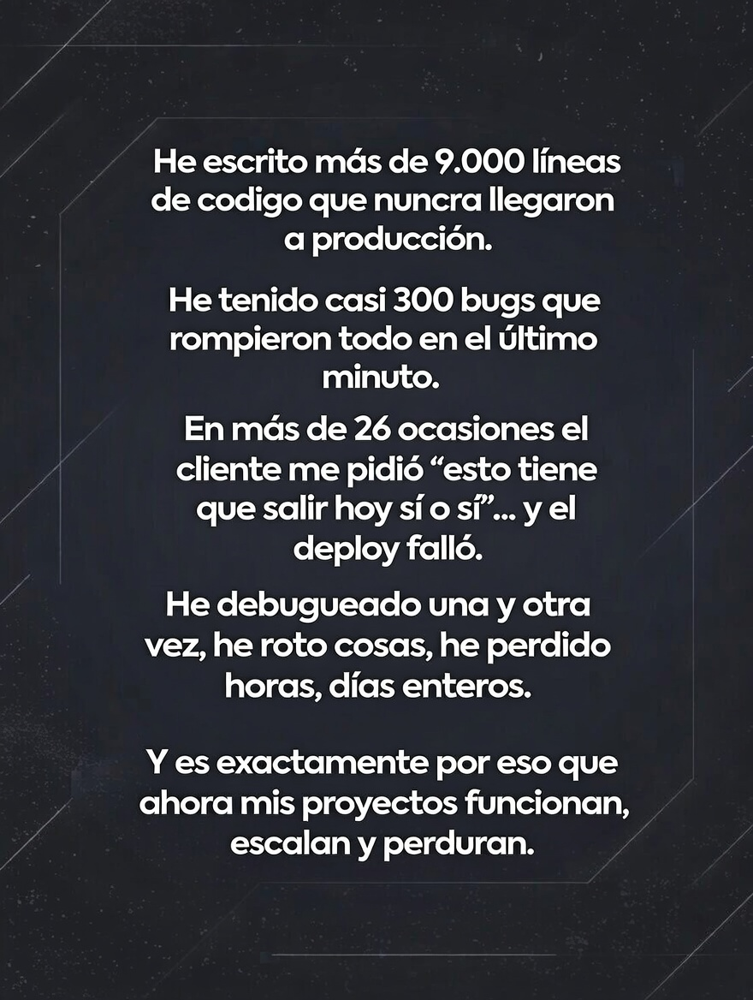

# KICK OFF | Material Extra

[Volver a Inicio](../../README.md)

## REPASO

- [Métodos de Arrays](./arrays_metodos.md)
- [Versionado de Software: Semantic Version](./semantic_version.md)
- [TypeScript: Guía Rápida de Consulta](./typescript_guia_rapida.md)
- [TypeScript: Errores Comunes](./typescript_errores_comunes.md)

## HÁBITOS

- [Hábitos Saludables](./habitos_saludables.md)
- [Técnicas de Estudio](./tecnicas_de_estudio.md)

## HERRAMIENTAS

- [Visual Studio Code: Atajos](./vscode_atajos.md)
- [Lenguaje Mark Down: Guía Rápida](./markdown_guia_rapida.md)

- Notas Digitales:
  - [Obsidian: Video de introducción (YouTube)](https://www.youtube.com/watch?v=64pI_dKYZOg&t=613s)
  - [Obsidian: Págnia oficial](https://obsidian.md/)
  - [Notion: Página oficial](https://www.notion.com/es)

- Aprender mecanografía: Escribir con todos los dedos de forma eficiente:
  - [El mundo de la Mecanografía](https://www.edclub.com/es/library/el-mundo-de-la-mecanograf%C3%ADa)
  - [Aprende Mecanografía](https://www.mecanografia-online.com/)
  - [Club de Mecanografía](https://www-typingclub-com.translate.goog/?_x_tr_sl=en&_x_tr_tl=es&_x_tr_hl=es&_x_tr_pto=tc)

 

---

 

 

---

[Volver a Inicio](../../README.md)
