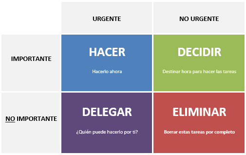

# Técnicas de Estudio

[Volver](./00-kick_off.md)

> técnicas populares de gestión del tiempo y productividad, incluyendo los cuadrantes de Stephen Covey, Pomodoro, el pájaro carpintero y otras útiles.

## 🧭 1. Cuadrantes de Stephen Covey (Matriz de Eisenhower)

Organiza las tareas según urgencia e importancia:

Objetivo:

- 🔁 Pasar del Cuadrante I (crisis) al II (prevención, desarrollo personal).
- ⚠️ Reducir el tiempo en los cuadrantes III (interrupciones) y IV (pérdidas de tiempo).

## ⏳ 2. Técnica Pomodoro

Divide el trabajo en bloques de foco + descanso:

- ⏲️ Trabajás 25 min (1 Pomodoro).
- 🛑 Descansás 5 min.
- 🔁 Cada 4 Pomodoros: descanso largo de 15-30 min.

Objetivo:

- Mejorar concentración, reducir fatiga mental, evitar multitasking.

## 🐦 3. Técnica del Pájaro Carpintero

- Metáfora de la constancia: no golpear fuerte una vez, sino muchas veces seguidas sin parar.
- Aplicás bloques repetitivos, intensos y rítmicos de trabajo.
- Muy parecida a Pomodoro, pero más centrada en la disciplina constante que en los tiempos exactos.

Objetivo:

- 💡 Crear progreso sostenido sin depender de la motivación.

## ✅ 4. Método GTD (Getting Things Done) – David Allen

- Sistema de organización en 5 pasos:
- Capturar todo lo que tengas que hacer.
- Procesar: ¿es accionable? Si no, descartar o archivar.
- Organizar: clasificar tareas por contexto, prioridad, proyecto.
- Revisar: chequear listas a diario y semanalmente.
- Hacer: ejecutá según lo definido.

Objetivo:

- 📤 Liberar la mente y confiar en un sistema externo.

## 🔢 5. Regla del 80/20 (Principio de Pareto)

- El 80% de los resultados proviene del 20% de las acciones.
- Identificá las tareas más impactantes y enfocá tu energía en ellas.

Objetivo:

- 🚀 Maximizar el impacto haciendo menos cosas, pero mejor elegidas.

## ⛰️ 6. Método Ivy Lee

- Cada noche:
- Escribí las 6 tareas más importantes para mañana.
- Ordenalas por prioridad.
- Al día siguiente, hacelas una por una, en orden.

Objetivo:

- ✅ Simplicidad, enfoque y avance real.

## 🧱 Comparación rápida

| Técnica               | Foco principal        | Ideal para...             |
| --------------------- | --------------------- | ------------------------- |
| **Covey**             | Urgencia/importancia  | Gestión de prioridades    |
| **Pomodoro**          | Tiempo/foco           | Evitar distracciones      |
| **Pájaro carpintero** | Ritmo/constancia      | Sostener progreso         |
| **GTD**               | Organización mental   | Múltiples proyectos       |
| **80/20**             | Impacto               | Productividad estratégica |
| **Ivy Lee**           | Simplicidad/prioridad | Acción enfocada diaria    |

---

[Volver](./00-kick_off.md)

[Volver a Inicio](../../README.md)
