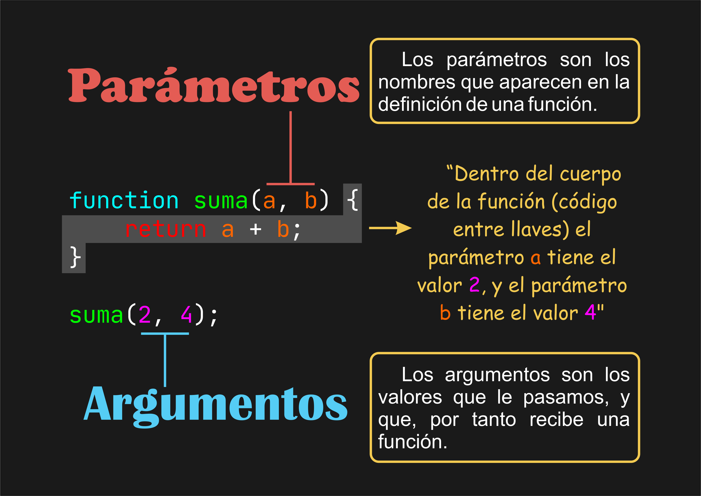

# 🧠 Parámetros y Argumentos en JavaScript

[Volver](../../README.md)

> Aunque muchas veces usamos estos términos como sinónimos, en realidad hacen referencia a conceptos distintos.



## 🏷️ Parámetros

🔹 Son los nombres de las variables que se escriben al definir una función.
🔹 Actúan como "contenedores" para los valores que se recibirán.

```js
function suma(a, b) {
  return a + b;
}
```

🧩 Aquí, a y b son parámetros.

## 🎯 Argumentos

🔸 Son los valores reales que pasamos al invocar la función.
🔸 Son los que "llenan" los parámetros.

```js
suma(2, 4);
```

🧩 Aquí, 2 y 4 son argumentos que se asignan a a y b respectivamente.

📝 Internamente, JavaScript hace algo similar a:

```js
let a = 2;
let b = 4;
```

## 📐 Ver la cantidad de parámetros esperados

- Podés ver cuántos parámetros espera una función usando la propiedad .length.

```js
function suma(a, b) {
  console.log(suma.length); // ➡️ 2
  return a + b;
}
```

🧠 Nota: .length muestra la cantidad de parámetros definidos, no la cantidad de argumentos que se pasan en la llamada.

## 👀 Ver los argumentos pasados a una función

- En funciones tradicionales, podés acceder a todos los argumentos usando el objeto especial arguments.

```js
function suma(a, b) {
  console.log(arguments); // [Arguments] { '0': 2, '1': 4 }
  console.log(arguments[0]); // 2
  console.log(arguments[1]); // 4
  return a + b;
}

suma(2, 4);
```

⚠️ Importante: arguments solo está disponible en funciones tradicionales (no en arrow functions).

## 🧰 Usando Rest Parameters (...args) y Destructuring

- Si querés que tu función acepte una cantidad variable de argumentos, usá el operador ... (rest parameters).

```js
function suma(...args) {
  console.log(args); // ➡️ [2, 4, 6, 8]

  const resultado = args.reduce((a, b) => a + b, 0);
  console.log(resultado); // ➡️ 20

  return resultado;
}

suma(2, 4, 6, 8);
```

✅ ...args convierte los argumentos en un array real, permitiendo usar métodos como .reduce(), .map(), etc.

💡 A diferencia de arguments, ...args sí funciona en funciones flecha.

## 📚 Para seguir investigando

- 🔍 Cómo funcionan las Arrow Functions y por qué no tienen arguments
- 🧩 Diferencias entre arguments y ...args
- 📏 Parámetros por defecto y parámetros rest

[Volver](../../README.md)
