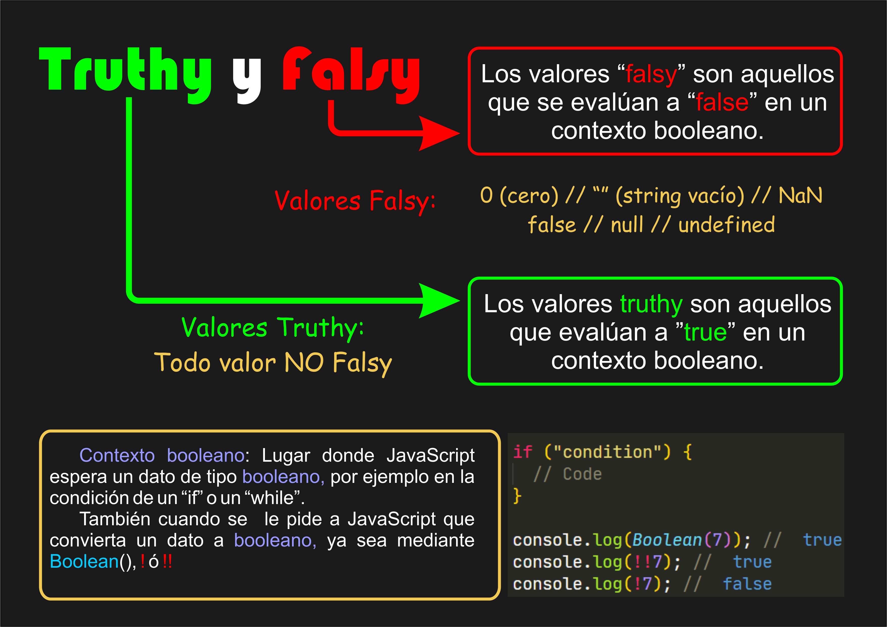

# Valores Truthy✅ y Falsy❌ en JavaScript

[Volver](../../README.md)

- En JavaScript, todas las expresiones se pueden evaluar en un contexto booleano (true o false).
- Un contexto lógico o booleano es cualquier situación en la que JavaScript necesita decidir entre dos opciones lógicas: verdadero (true) o falso (false), por ejemplo, dentro de una estructura condicional (if, else if o while).
- Cuando eso ocurre, el lenguaje convierte automáticamente (coerción implícita) el valor evaluado a un booleano.
- Los valores que se consideran falsos se llaman falsy, y todo lo demás es truthy.

## ❌Valores Falsy

- Son los valores que JavaScript considera como false al evaluarlos en un contexto lógico.
- Tabla de valores falsy:

```txt
| Valor       | Tipo          | Resultado Booleano | Explicación                            |
|------------ |---------------|--------------------|----------------------------------------|
| false       | Boolean       | false              | El valor booleano falso literal.       |
| 0           | Number        | false              | El número cero se considera falso.     |
| -0          | Number        | false              | Cero negativo también es falso.        |
| 0n          | BigInt        | false              | Cero en BigInt también es falsy.       |
| ""          | String        | false              | Cadena vacía → sin contenido.          |
| null        | Object/null   | false              | Representa ausencia de valor.          |
| undefined   | Undefined     | false              | Valor no definido.                     |
| NaN         | Number        | false              | Resultado de operaciones inválidas.    |
```

📗 Ejemplos de falsy:

```js
if (!0) console.log("0 es falsy"); // ✅ Se ejecuta
if (!"") console.log("Cadena vacía"); // ✅ Se ejecuta
if (!undefined) console.log("Undefined"); // ✅ Se ejecuta
if (!NaN) console.log("NaN es falsy"); // ✅ Se ejecuta
```

## ✅Valores Truthy

- Son todos los valores que no están en la lista de falsy, y por lo tanto se consideran verdaderos.
- Ejemplos comunes de truthy:

```txt
| Valor         | Tipo        | Resultado Booleano | Explicación                            |
|---------------|-------------|--------------------|----------------------------------------|
| true          | Boolean     | true               | Valor booleano verdadero literal.      |
| 1, -1, 3.14   | Number      | true               | Cualquier número distinto de cero.     |
| "Hola"        | String      | true               | Cadena no vacía.                       |
| []            | Object      | true               | Un array vacío sigue siendo objeto.    |
| {}            | Object      | true               | Un objeto vacío también es truthy.     |
| function(){}  | Function    | true               | Toda función es truthy.                |
| Symbol()      | Symbol      | true               | Los símbolos siempre son truthy.       |
```

📗 Ejemplos de truthy:

```js
if ("JS") console.log("Cadena con texto"); // ✅ Se ejecuta
if (42) console.log("Número distinto de cero"); // ✅ Se ejecuta
if ([]) console.log("Array vacío"); // ✅ Se ejecuta
if ({}) console.log("Objeto vacío"); // ✅ Se ejecuta
```

## 🔹Conversión Implícita y Explícita

### Conversión Implícita

- JavaScript convierte los valores automáticamente al evaluarlos en un contexto lógico.

📘 Ejemplo:

```js
let nombre = "Ariel";
if (nombre) {
  console.log("El nombre es truthy");
}

"Ariel" es truthy, por lo tanto, el bloque if se ejecuta.
```

### Conversión Explícita con Boolean() o !!

📗 Ejemplo:

```js
console.log(Boolean("Hola")); // true
console.log(Boolean(0)); // false
console.log(!!"Texto"); // true
console.log(!!null); // false
```



[Volver](../../README.md)
