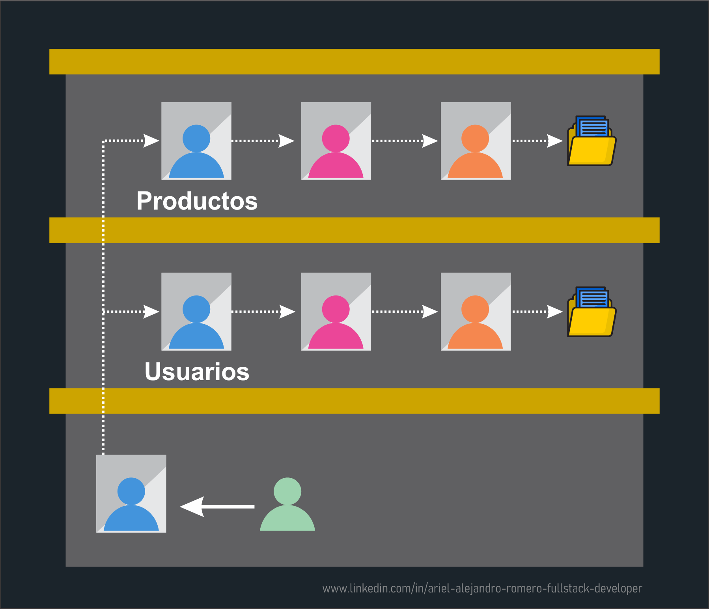
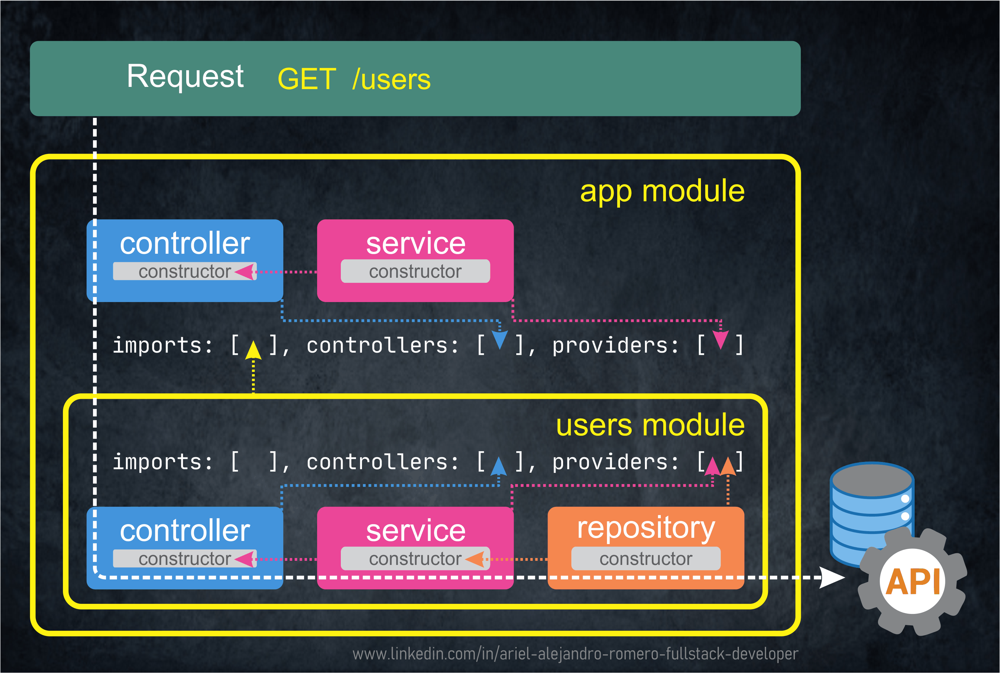

# Nest JS - Nest JS Fundamentals II

[Volver a Inicio](../../README.md)

## Indice

- [Repositorios en NestJS](#repositorios-en-nestjs)
- [Características de NestJS](#características-de-nestjs)
- [Módulos y Capas de NestJS](#módulos-y-capas-de-nestjs)
- [Flujo de Datos en NestJS](#flujo-de-datos-en-nestjs)

## Repositorios en NestJS

- El Repositorio es el componente encargado de gestionar el acceso a los datos.
- Su función principal es interactuar con la base de datos u otros servidores (APIs).
- El repositorio es el puente entre la lógica de negocio y la base de datos.
- Es una Clase decorada con `@Injectable()`, por lo que se trata de un Provider.
- Responsabilidades del Repositorio:
  - Acceder a la base de datos o a otras APIs.
  - Encapsular la lógica de persistencia de datos, separándola de los Servicios.
  - Dar respuesta a los Servicios.

[Volver a Indice](#indice)

---

## Características de NestJS

- NestJS es un framework para construir aplicaciones del lado del servidor (backend) utilizando TypeScript.
- Está basado en una arquitectura modular y en principios de diseño modernos que permiten crear aplicaciones escalables, mantenibles y bien estructuradas.

### Se apoya principalmente en:

- 🧩 Arquitectura modular y patrones de diseño
  - Organización del código en módulos.
  - Aplicación de patrones como:
    - Separación de responsabilidades
    - Arquitectura por capas (Presentación/Controladores, Negocio/Servicios, Persistencia/Repositorios)
- ⚙️ Inyección de dependencias (DI)
  - NestJS implementa un sistema robusto de inyección de dependencias que permite:
    - Reducir el acoplamiento entre componentes.
    - Reutilizar servicios y providers.

[Volver a Indice](#indice)

---

## Módulos y Capas de NestJS

### **Módulos**

- **Función**: Agrupar y organizar el código relacionado por entidades.
- **Características**: Usa `@Module()`, encapsula componentes relacionados, facilita la reutilización.

### **Controladores**

- **Función**: Gestionar rutas y solicitudes HTTP, desestructurar información y dar respuesta al Cliente.
  - **Características**: Usa `@Controller()`, define rutas, interactúa con servicios.

### **Servicios**

- **Función**: Contener la lógica de negocio.
- **Características**: Usa `@Injectable()`, implementa métodos de negocio, interactúa con repositorios.

### **Repositorios**

- **Función**: Manejar la interacción con la base de datos u otras APIs.
- **Características**: Proporciona abstracción sobre CRUD, define métodos personalizados. Es quien interactúa con los ORMs. (Object Relational Mapping).

[Volver a Indice](#indice)

---

## Flujo de Datos en NestJS

### Nuestro Ejemplo Completo

### Request a GET a "/users"

[Volver a Indice](#indice)

---

[Volver a Inicio](../../README.md)
