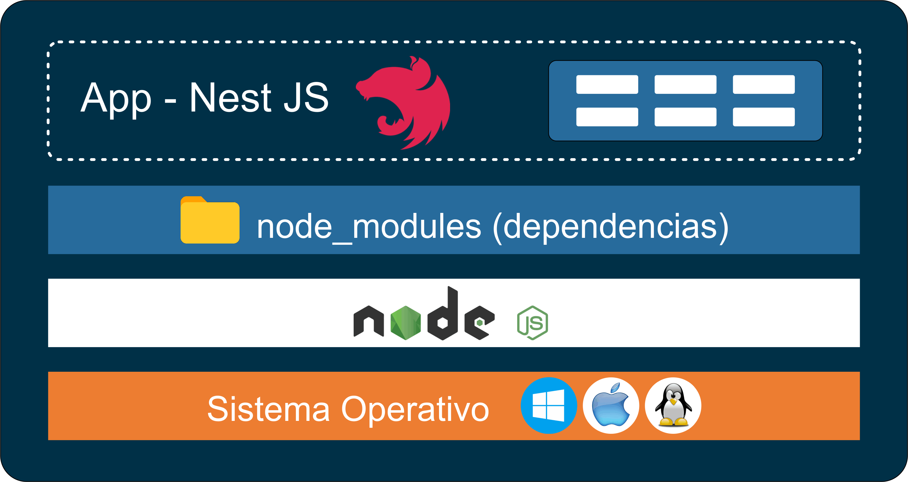
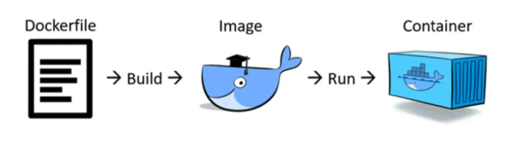
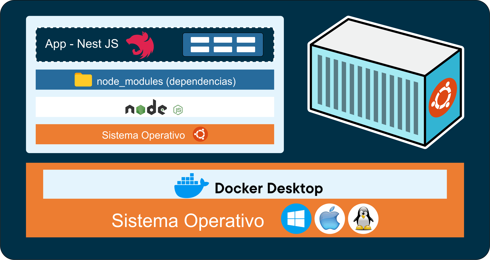

# 🐳DOCKER

[Volver a Inicio](../../README.md)

> Docker es una plataforma de contenedores que permite empaquetar, distribuir y ejecutar aplicaciones junto con todas sus dependencias en un entorno aislado y reproducible llamado contenedor.

## ¿QUÉ PROBLEMA VIENE A RESOLVER?



## UN EJEMPLO






## ⚙️ Conceptos clave

### 🔹Imagen (Image)

- Es una plantilla inmutable que contiene todo lo necesario para ejecutar una aplicación:
  - sistema base + librerías + dependencias + código + configuración
- Se define mediante un archivo Dockerfile.
- [Ejemplo de Archivo Dockerfile](../../docker/Dockerfile)

### 🔹Contenedor (Container)

- Es una instancia en ejecución de una imagen.
- Se comporta como un pequeño sistema aislado, pero usa el kernel del host.

### 🔹Docker Compose

- Permite definir y ejecutar múltiples contenedores (por ejemplo: backend + base de datos + frontend) con un solo comando, usando un archivo docker-compose.yml.
- [Ejemplo de Archivo docker-compose.yml](../../docker/docker-compose.yaml)

### 🧩Ventajas

- ✅ Aislamiento de entornos
- ✅ Reproducibilidad (mismo entorno en todos los equipos)
- ✅ Portabilidad (funciona igual en cualquier sistema con Docker)
- ✅ Escalabilidad (ideal para microservicios)

## LINKS

- [Docker - Documentación](https://www.docker.com/)
- [Descargar para Windows](https://www.docker.com/products/docker-desktop/)
- [Instructivo de Instalación para Windows](https://docs.docker.com/desktop/install/windows-install/)
- [Documentación para desarrolladores](https://docs.docker.com/?_gl=1*1m0ompz*_ga*MjAyNTczMDU3OS4xNzE0NTE3MzMx*_ga_XJWPQMJYHQ*MTcxNDUxNzMzMS4xLjEuMTcxNDUxODY5OS41Ni4wLjA.)
- [Docker Hub](https://hub.docker.com)
- [Docker Hub - postgres](https://hub.docker.com/_/postgres)
- [npkill - Borrar node_modules](https://www.npmjs.com/package/npkill)

## TRABAJANDO CON DOCKER

### VERIFICAR INSTALACIÓN

- Ingresamos en la Terminal Integrada:

```bash
docker
# Nos brinda las opciones que podemos ejecutar en su entorno

docker-compose
# Nos brinda las opciones que podemos ejecutar en su entorno
```

⚠️ Recordar que Docker Desktop debe estar en ejecución para ejecutar sus comandos!!!

### PLUGIN PARA VISUAL STUDIO CODE

- [Link](https://code.visualstudio.com/docs/containers/overview)

### EJEMPLO DE DOCKER FILE

```dockerfile
FROM node:22.17              # Entorno de ejecución a utilizar
WORKDIR /app                 # Carpeta raíz del contenedor
COPY package*.json ./        # Copiamos archivo package.json (y package-lock.json)
RUN npm install              # Ejecuta "npm install" (en Contenedor)
COPY . .                     # Copiamos TODOS los archivos(.) de raíz(./)
EXPOSE 3000                  # Puerto que expondrá el Contenedor
CMD ["npm", "run", "start"]  # Comandos a ejecutar 
```

### EJEMPLO DE .dockerignore

- Archivo ".dockerignore"
  - Lo creamos en la Raíz del proyecto
  - Incluimos en él las carpetas y archivos a ignorar por Docker

```.dockerignore
node_modules
dist
```

### CREAR IMAGEN

- Comando: docker build
- Especificamos ubicación del Dockerfile: "." => En la misma carpeta

```bash
docker build .
```

### INICIALIZAR CONTENEDOR

- Comando: docker run
- Indicamos puertos: -p `<puertoHost>:<puertoContenedor>`
  - No necesariamente deben ser los mismos
- Indicamos "id" de la Imagen: sha256:---

```bash
docker run -p 3000:3008 <imagenId>
```

### ALGUNOS COMANDOS DE DOCKER

```bash
# IMAGENES de Docker
docker images
docker image ls

# CONTENEDORES en ejecución
# ps: process status
docker ps

# Todos los CONTENEDORES
docker ps -a
docker ps --all

# Detener CONTENEDOR
docker stop <nombreContenedor>

# Networks
docker network ls

# Borrar IMAGEN
dockre rmi <nombreIMAGEN_o_idImagen>

# Borrar CONTENEDOR
docker rm <nombreContenedor_o_idContenedor>

# Borrar NETWORK
docker network rm <nombreNetwork_o_idNetwork>

# Correr CONTENEDOR existente
docker start <puertoHost>:<puertoContenedor> <nombreContenedor_o_idContenedor>
```

### DOCKER COMPOSE

[Ejemplo de Archivo "docker-compose.yaml"](../../docker/docker-compose.yaml)

Configuración

- Creamos nuevo archivo "docker-compose.yaml" y seteamos configuración.
  - Recordar que en archivos yaml es importante la identación!!!
- Agregar variables de entorno en archivo ".development.env".
- No olvidar setear "synchronize" y "dropSchema" de typeorm en false.
- Correr en consola el comando `docker compose up` en la ubicación del archivo "docker-compose.yaml".

### ACCEDER A LA CONSOLA SQL DE UN CONTENEDOR

```bash
# Obtener el nombre del CONTENEDOR de la BBDD:
docker ps

# Ingresar a la consola "bash" del contenedor:
docker exec -it <nombre_contenedor> bash

# Ingresar a la consola "psql":
psql -U <usuario> -d <base_de_datos>

# Hacer Admin a un Usuario:
UPDATE users SET isAdmin = true WHERE name = 'Homero';
```

---

[Volver a Inicio](../../README.md)
