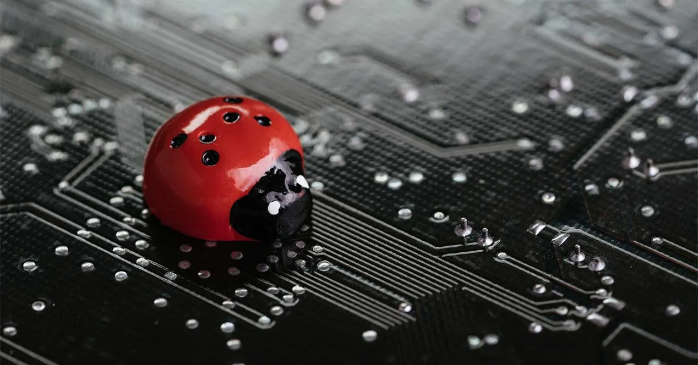
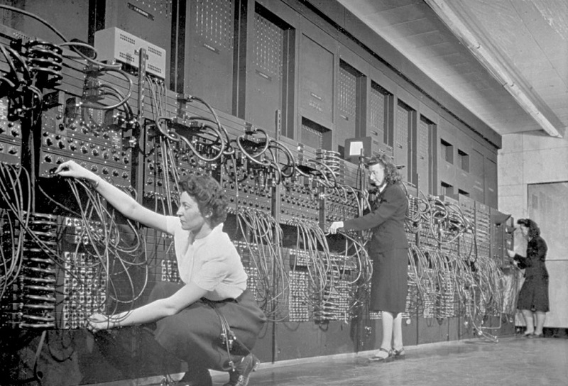
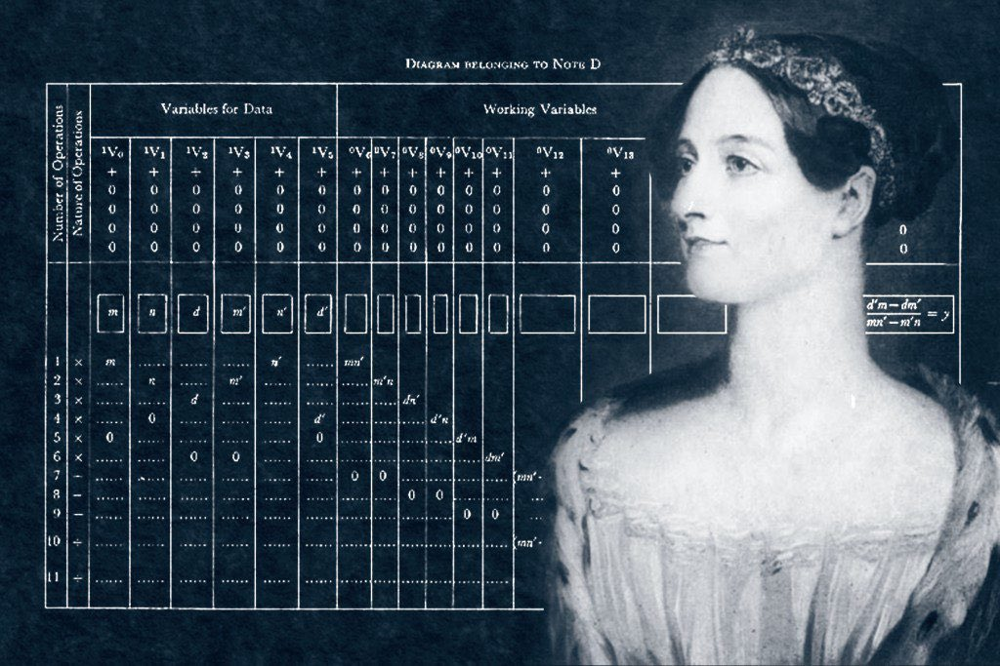
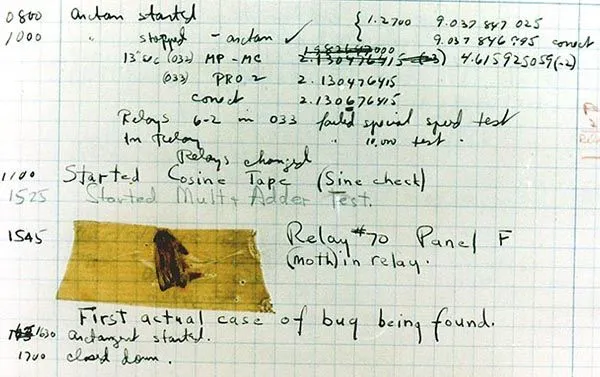
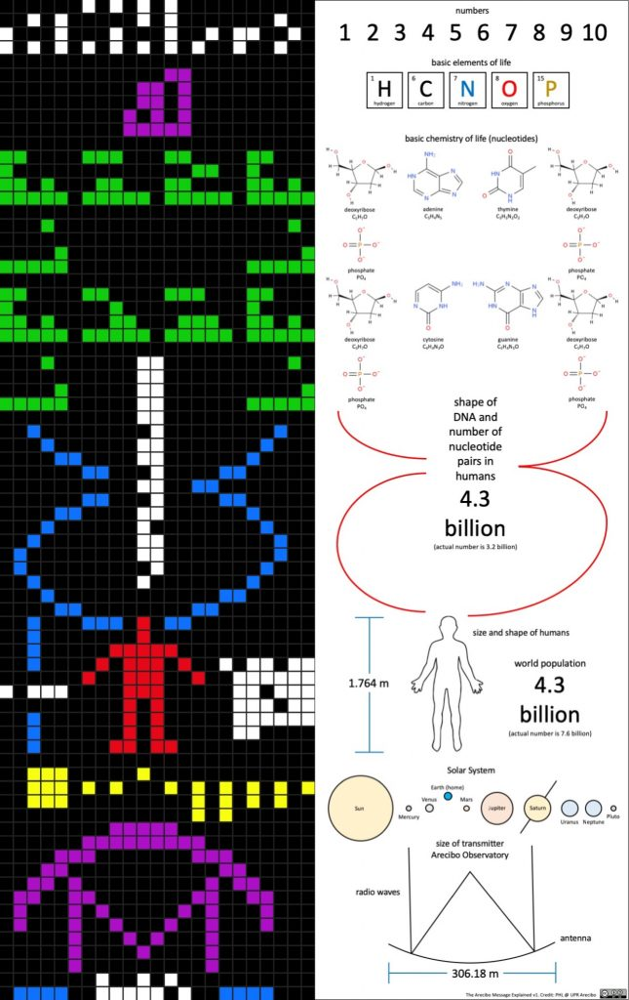

# 🖥️ PROGRAMACIÓN Y CURIOSIDADES DEL MUNDO DEV

[Volver a Inicio](../../README.md)

## 📅 El Día de la Programación

- Se celebra el día número 256 del año.
  - En años normales: 13 de septiembre.
  - En años bisiestos: 12 de septiembre.
- ¿Por qué 256?
  - 256 (2⁸) es un número clave en informática:
  - Representa los valores posibles de 1 byte (8 bits).
  - Es una potencia de 2 muy utilizada (arrays, colores, memoria, etc.).
  - Por eso se eligió el día 256 como el Día del Programador/a.
- Origen:
  - 💡 En 2002, los programadores rusos Valentin Balt y Michael Cherviakov propusieron la idea.
  - En 2009, Rusia lo oficializó como feriado profesional.
  - 🌍 Hoy se celebra en todo el mundo, de forma oficial o informal.

## 🛠️ El trabajo no termina al terminar

- Más del 50% del esfuerzo total en software se destina al mantenimiento: corregir bugs, actualizar, mejorar y adaptar a nuevas necesidades.
- 👉 Programar no es solo crear, también es evolucionar.

## 🖥️ La primer Computadora

1. Máquina analógica de Charles Babbage (1837)
   - Se le llama la “máquina analítica”, y es considerada la primera computadora mecánica programable.
   - Nunca se construyó completamente en su época, pero sentó las bases de la computación moderna.
2. ENIAC (1945)
   - La Electronic Numerical Integrator and Computer fue la primera computadora electrónica de propósito general.
   - Pesaba más de 27 toneladas, ocupaba 167 m² y usaba cerca de 18.000 tubos de vacío.
   - Podía realizar cálculos mucho más rápido que cualquier máquina mecánica previa.
3. Otros pioneros
   - Colossus (1943-1944): computadora electrónica usada en el descifrado de códigos en la Segunda Guerra Mundial, pero era especializada, no de propósito general.
   - Z3 (1941) de Konrad Zuse: primera computadora electromecánica totalmente automática y programable.

ENIAC, la primer computadora de propósito general.

## 💻 El primer lenguaje de programación moderno

- FORTRAN (Formula Translation), creado por IBM en 1957.
- Fue el primer lenguaje de alto nivel.
- Antes, los programas se escribían directamente en código máquina, ¡solo ceros y unos!
- Aún se usa en ciencia e ingeniería por su eficiencia en cálculos numéricos.

## 🧠 Habilidades del/la programador/a

- Más del 70% de los trabajos de programación están en industrias fuera de la tecnología.
- Aprender a programar desarrolla:
  - Pensamiento lógico 🔍
  - Resolución de problemas 🧩
  - Creatividad 🎨
  - Trabajo colaborativo 🤝

## 🌅 Programar puede ser arte

- Algunos programadores hacen arte con código, generando gráficos, música o poesía usando solo instrucciones de programación.
- Incluso hay competencias de “code golf”, donde gana quien hace un programa funcional con menos líneas o caracteres posibles.

## 👩‍🔬 La primer programadora

- La primera persona en programar fue Ada Lovelace (1815-1852).
- Escribió el primer algoritmo destinado a ser ejecutado por una máquina de Charles Babbage.
- Hoy es considerada la madre de la programación.

Ada Lovelace, la primer programadora.

## 💬 Los comentarios en código tienen historia

- Los primeros lenguajes no permitían comentarios.
- Hoy, los comentarios son esenciales para entender código, pero también hay programadores que los usan para escribir chistes internos o mensajes ocultos.

## 🎮 Código escondido en videojuegos

- Algunos videojuegos clásicos tenían mensajes secretos de los desarrolladores en el código.
- Por ejemplo, en Atari 2600, Warren Robinett escondió su nombre en Adventure (1979) porque no estaba permitido poner créditos.

## El código más caro del mundo

- En 1995, un bug en el software de la NASA provocó la pérdida de la sonda Mars Climate Orbiter.
- El error: la diferencia entre libras y newtons, un fallo de conversión de unidades.
- Valor estimado de la pérdida: U$D 125 millones.

## 🐞 Origen de la palabra Bug

- En 1947, Grace Hopper encontró una polilla en un ordenador que causaba fallos.
- Desde entonces, los errores de software/hardware se llaman bugs.
- El documento original aún se conserva como una reliquia.

Documento original que registró el primer "bug".

## 🌐 ¿Cuántos lenguajes existen?

- Hoy en día hay más de 700 lenguajes de programación.
- Los niños pueden empezar con Scratch 🐱 y avanzar a Python, Java, C++, etc.

## 👋 Hello, World!

- El clásico programa "Hello, World!" es el rito de iniciación de todo programador.
- Fue usado por primera vez en 1972 en un manual de C por Brian Kernighan.
- Simboliza el primer paso en cualquier lenguaje.

## ☕ Programación y Café

- El café es la bebida favorita de la mayoría de los programadores.
- No solo es un estimulante, también es parte del ritual creativo y de concentración.

## 👽 Código en el espacio

- Las primeras computadoras en llegar al espacio usaban lenguajes muy básicos, pero hoy un smartphone moderno tiene más poder que la computadora que llevó al hombre a la luna.
- El primer mensaje enviado al espacio era código: En el año 1946, científicos de EE. UU lanzaron un cohete V-2 con señales codificadas para medir temperatura, presión y radiación; no era lenguaje humano, sino datos en código binario y pulsos de radio.
- El primer mensaje “con significado” lanzado al espacio fue en el año 1974, y se trató del Mensaje de Arecibo, un mensaje binario de 1.679 bits diseñado por Frank Drake y Carl Sagan, cuyo objetivo era comunicar información sobre la humanidad y nuestro sistema solar a posibles civilizaciones extraterrestres.

Mensaje de Arcebio

## 🦠 El primer software autorreplicante

- En 1971 nació Creeper, el primer "virus" experimental en ARPANET.
- Mostraba: "I’m the creeper, catch me if you can!".
- Esto inspiró la creación del primer antivirus: Reaper.

## 🤯 Datos curiosos extra

- 🕹️ El primer videojuego de la historia fue Tennis for Two (1958), antes incluso que Pong.
- 📀 En 1983, el lenguaje C++ introdujo la programación orientada a objetos de forma masiva.
- 🐍 El nombre de Python no viene de la serpiente, sino del grupo cómico británico Monty Python.
- 📊 COBOL, creado en 1959, todavía corre en bancos, aerolíneas y gobiernos.
- 📱 La primera app de la App Store en 2008 fue Texas Hold’em Poker.
- 🚀 Hoy la programación está en todo: desde cohetes espaciales de SpaceX hasta tu smartwatch.
- ✨ Estos datos muestran que la programación no es solo código, es historia, creatividad y el motor del futuro digital.

---

[Volver a Inicio](../../README.md)
