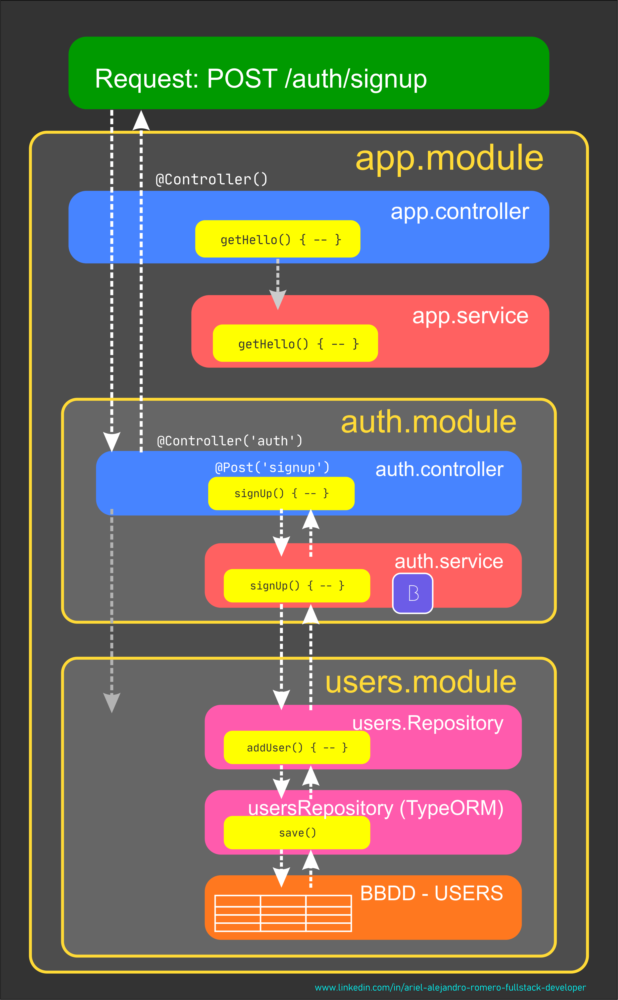
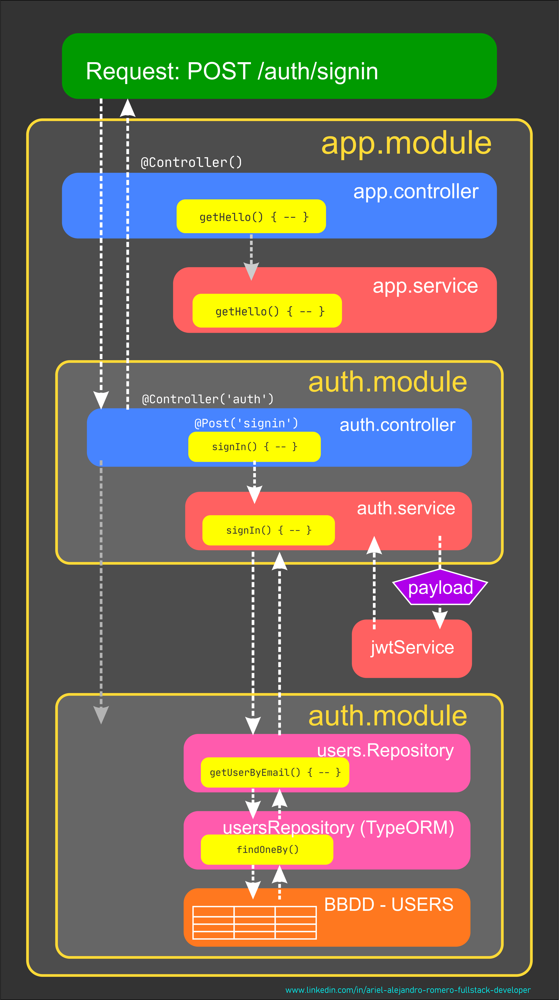
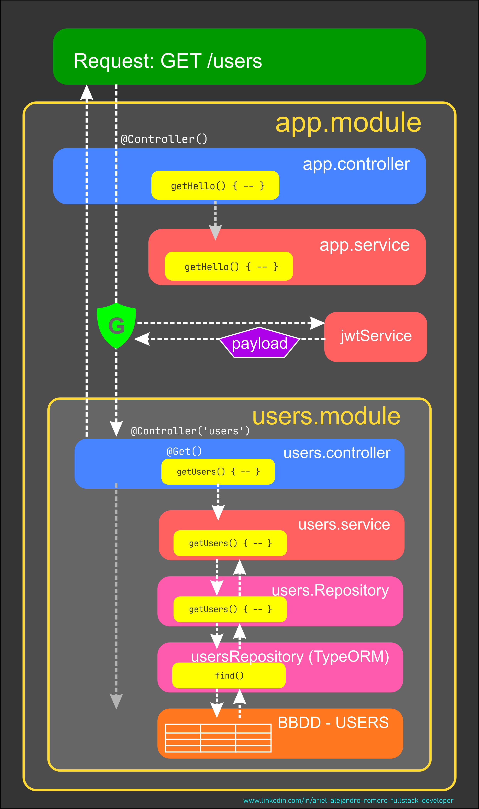

# REPASO GENERAL DEL PROYECTO INTEGRADOR

[Volver a Inicio](../../README.md)

## [Rúbrica Back-End](https://docs.google.com/document/d/1UUf1nSrfpW8deDxakouTYXFyztwAUjixeYPW5c8rGx4/edit?tab=t.0)

## Autenticación y Autorización

### POST /auth/signup

### POST /auth/signin

### GET /users

---

[Volver a Inicio](../../README.md)
